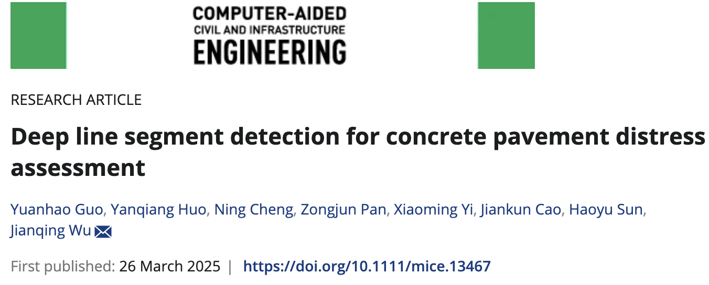
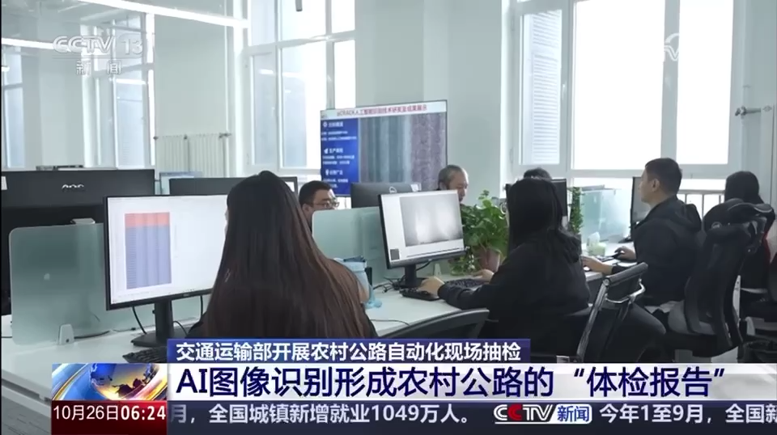
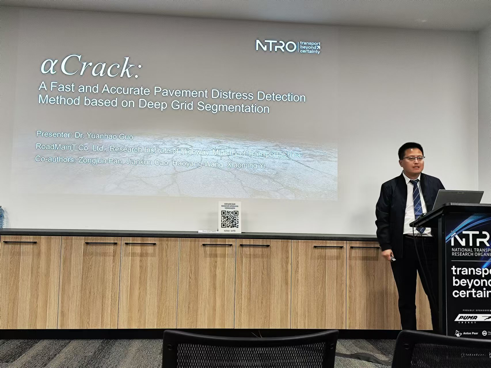

+ On 26$^{th}$ Mar. 2025, our paper "Deep line segment detection for concrete pavement distress assessment" was published in "Computer-Aided Civil and Infrastructure Engineering" [link](https://onlinelibrary.wiley.com/doi/10.1111/mice.13377).

---

+ On 26$^{th}$ Oct. 2024, our "AI-based Pavement Distress Detection Sytem" was reported by CCTV news in Oct. 2024. The original program can be found from here: [link](https://tv.cctv.com/2024/10/26/VIDE41vu2mhxEyCrLPpnxwlE241026.shtml?spm=C45404.PlcSaTuIQb0E.ENSvHePEGND5.17).

---

+ In Sept. 2024, we held the "Technical Innovation Salon of Youth Talents" at Research Institute of Highway Ministry of Transport and gave a talk on "AI for RoadMaintenance".
   

</img>

---

+ In Oct. 2023, we reported our work on "AI-based Pavement Distress Detection System" at International Technical Conference of National Transport Research Organisation (NTRO) at Melbourne, AUS.

</img>

---