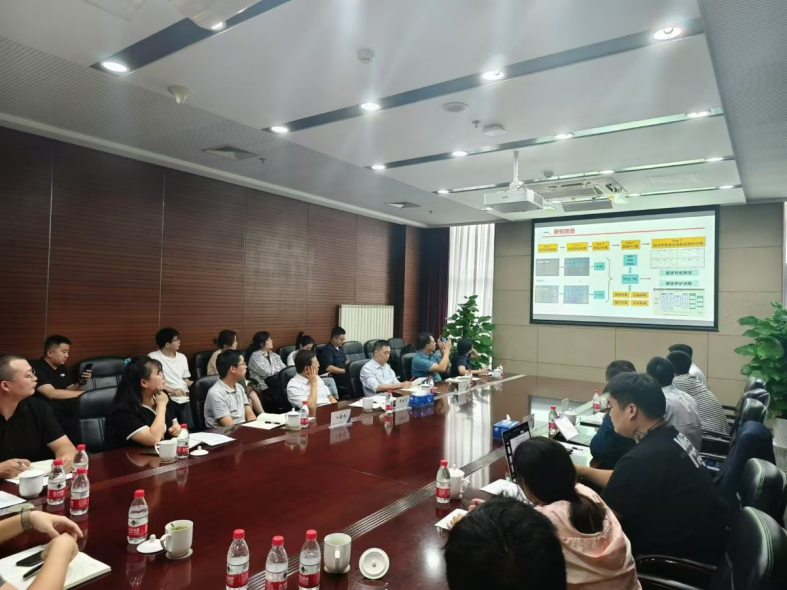

+ Our previous work "The endoplasmic reticulum junction serves as a platform for lysosome-endosome interaction through their 'stop-and-go' motion switching" has been accepted by the journal "Science Advances". The study establishes ER junctions as central to coordinating organelle dynamics and spatial distribution in the cytoplasm.

---
+ In June 2025, our research "Spatiotemporal Big Data-Driven Integrated Highway Asset Management Technology and Application" winned the IRF 2025 Award – Assets Management and Maintenance.

---
+ In June 2025, our research "Spatiotemporal Big Data-Driven Integrated Highway Asset Management Technology and Application" winned the IRF 2025 Award – Assets Management and Maintenance.

---
+ In July 2025, I was invited to present our latest research results on "Spatio-temporal Big Data-Driven Intelligent Pavement Distress Perception System" at the 17th International Exhibition on Transport Technology & Equipment, Beijing. Snapshots of the events can be seen from [link](https://m.alltuu.com/album/2122427104/?menu=live).

---
+ In Apr. 2025, I was promoted as the "Youth Chief Expert" of Research Institute of Highway Ministry of Transport.
  
---

+ On 26$^{th}$ Mar. 2025, our paper "Deep line segment detection for concrete pavement distress assessment" was published in "Computer-Aided Civil and Infrastructure Engineering" [link](https://onlinelibrary.wiley.com/doi/10.1111/mice.13467?af=R).

---

+ On 26$^{th}$ Oct. 2024, our "AI-based Pavement Distress Detection Sytem" was reported by CCTV news. The original program can be found from here: [link](https://tv.cctv.com/2024/10/26/VIDE41vu2mhxEyCrLPpnxwlE241026.shtml?spm=C45404.PlcSaTuIQb0E.ENSvHePEGND5.17).

---

+ In Sept. 2024, we held the "Technical Innovation Salon of Youth Talents" at Research Institute of Highway Ministry of Transport and gave a talk on "AI for RoadMaintenance".
   

</img>

---

+ In Oct. 2023, we reported our work on "AI-based Pavement Distress Detection System" at International Technical Conference of National Transport Research Organisation (NTRO) at Melbourne, AUS.

</img>

---