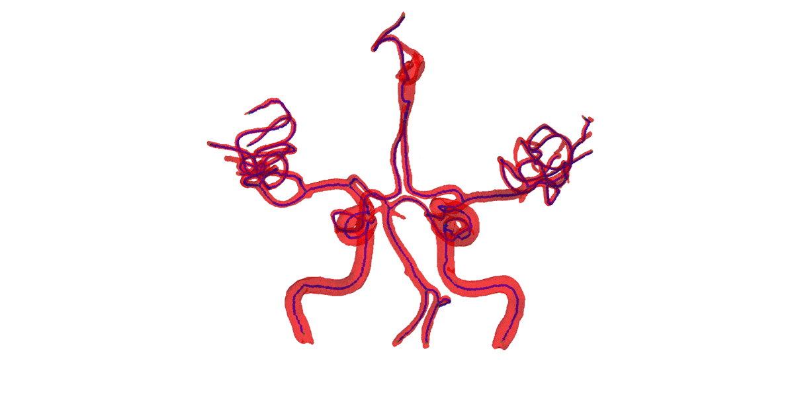

---

#### 

***Research goal***

Developing novel computational methods for detecting diseases and achieving 3D morphological analysis from X-ray, CT, and MRI images.

 

***Methods & Applications***

+ <u>Retinal fundus image analysis</u>
  
  (1) Proposed a spatial constrained mechanism to improve the Mask R-CNN to achieve accurate segmentation of optic disc/cup from retinal fundus images.

  (2) Proposed a cascaded regression model to localize the fovea and applied model-ensembling to improve glaucoma classification.

  (3) Led a team to attend the REFUGE2 challenge from MICCAI 2020 (6/134).

---

+ <u>Cerebral artery morphology analysis from MRI images</u>
  
  (1) Devised 3D networks to detect cerebral artery from brain MRI images. Utilized spatial locations to localize each artery blood vessel.

  (2) Reconstructed the 3D network of the cerebral artery and proposed novel metrics to evaluate the stenosis level of each blood vessel. Statistical method was employed to demonstrate the correlation between cerebrovascular stenosis and occurrence of Alzheimer's Disease in aging people.

</img>

---

+ <u>Stent apposition analysis from OCT images</u>
  
  (1) Proposed a mutual guided attention module to improve the U-shaped segmentation network for detecting vessel walls and stents from optical coherence tomography (OCT) images.
  
  (2) Reconstructed the 3D shapes of the vessel walls and stents for quantifying the stent apposition in 3D space. The result of this study can be used as a novel metric to assess the quality of stent implantation.

<video src="oct.mp4" autoplay="false" controls="controls" width="640" height="320"></video>

---

+ <u>TFCC morphology analysis from MRI images</u>
  
  (1) The complicated anatomy of triangular fibrocartilage complex (TFCC) makes it vulnerable to be injured. The accurate 3D model of TFCC may enable the studies on its kinematic and dynamic mechanisms.
 
  (2) MRI images were obtained from coronal, sagittal, and axial views for the wrist. Image alignment and fusion were performed to enhance the image quality. 3D image segmentation model was applied to extract different components of TFCC, which were used to reconstruct its 3D model.