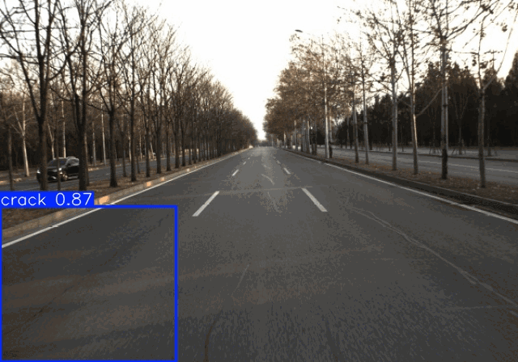
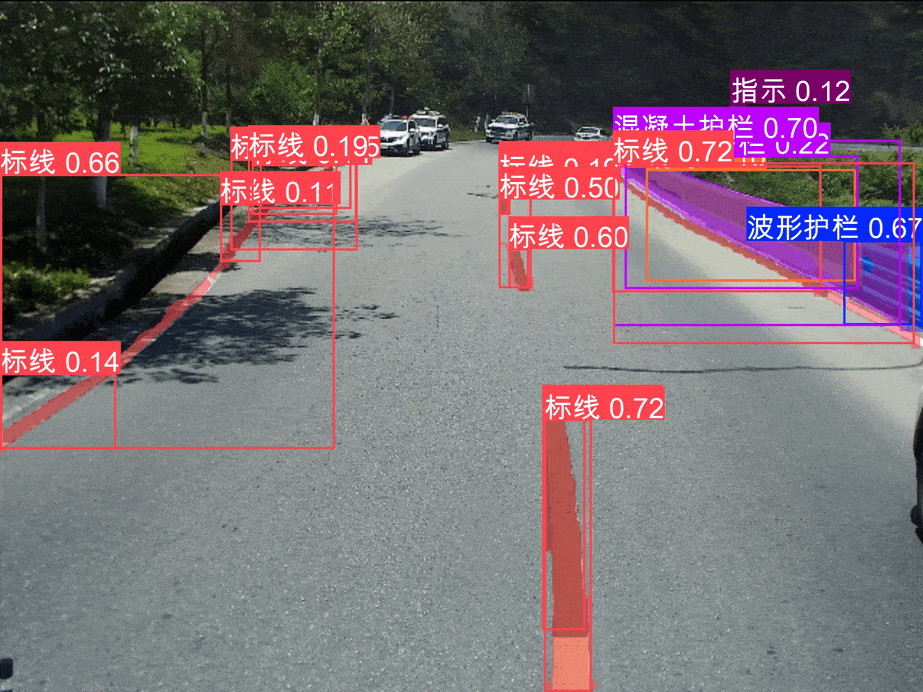

---

#### 

***Research goal***

Developing novel deep learning models and computer vision methods to solve practical problems in industry.

 

***Methods & Applications***

+ <u>Pavement distress detection system</u>
   
  (1) Accurate detection of pavement distress provides a metric to assess the condition of roadway. A grid segmentation method was developed, which uses a shared backbone network and a multi-branch output layer to recognize multiple types of pavement distresses, like crack, alligator crack, sealed crack, etc.

  (2) Developed a novel network architecture for detecting different types of line segments on concrete pavement, like joints, sealed joints and road boundaries. The network consisted of a backbone network for feature extraction, and a dual-prediction head to localize/classify the line segment. A novel dual-attention module was proposed to handle the semantic similarity among different types of line segments.

  (3) A joint detection network was proposed for identifying multi-scale objects on pavements. An encoder network detected pavement distresses represented by grid (sealed crack, crack, pothole), and a decoder with a feature fusion module detected objects represented at pixel level (joints). A cross-attention module bridged the multi-scale features from these two types of objects.

  (4) A road fast survey device was developed. An industrial camera and a GPS module were mounted on top of the vehicle to capture front-view images of the road and record the location. Latest YOLO models were adapted and deployed in an AI edge device to detect pavement distresses from images in real-time.

</img>

<video src="distress_det.mp4" autoplay="true" controls="controls" width="640" height="320"></video>

</img>

 

</img>

 ---

+ <u>Semi-supervised object detection</u>
  
  (1) Proposed a novel semi-supervised object detection method based on temporal model ensembling, which used a large number of unlabelled data to improve the performance of an object detector.

  (2) This method employed the teacher-student framework originated from knowledge distillation. The prediction results of unlabelled data were obtained by integrating the detection results of teacher network from previous training steps, which were used to train the student network in an unsupervised manner.

